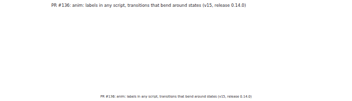
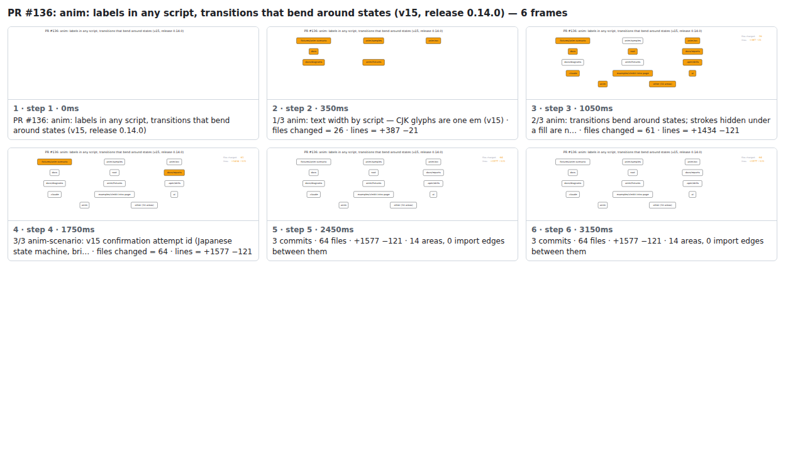

## PR #136: anim: labels in any script, transitions that bend around states (v15, release 0.14.0)



<details><summary>Every step</summary>



```
PR #136: anim: labels in any script, transitions that bend around states (v15, release 0.14.0) — 6 steps, 3360ms, 20 nodes
 1. [    0ms] PR #136: anim: labels in any script, transitions that bend around states (v15, release 0.14.0)
 2. [  350ms] 1/3 anim: text width by script — CJK glyphs are one em (v15) · files changed = 26 · lines = +387 −21
 3. [ 1050ms] 2/3 anim: transitions bend around states; strokes hidden under a fill are n… · files changed = 61 · lines = +1434 −121
 4. [ 1750ms] 3/3 anim-scenario: v15 confirmation attempt id (Japanese state machine, bri… · files changed = 64 · lines = +1577 −121
 5. [ 2450ms] 3 commits · 64 files · +1577 −121 · 14 areas, 0 import edges between them
 6. [ 3150ms] (end)
```

</details>

<sub>Generated by `vlmkit-anim pr`; the scene is [`change-map.scene.json`](./change-map.scene.json) — edit it and re-run `vlmkit-anim video` for a different cut, or `vlmkit-anim still` for the figure alone ([`change-map.svg`](./change-map.svg)).</sub>
