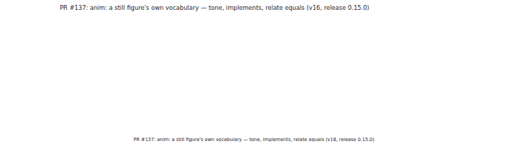
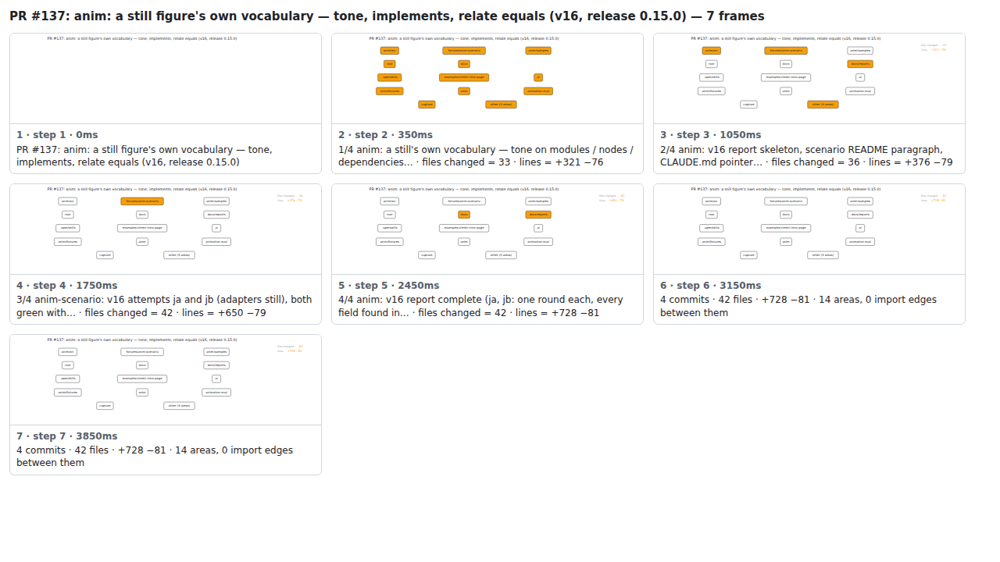

## PR #137: anim: a still figure's own vocabulary — tone, implements, relate equals (v16, release 0.15.0)



<details><summary>Every step</summary>



```
PR #137: anim: a still figure's own vocabulary — tone, implements, relate equals (v16, release 0.15.0) — 7 steps, 4060ms, 20 nodes
 1. [    0ms] PR #137: anim: a still figure's own vocabulary — tone, implements, relate equals (v16, release 0.15.0)
 2. [  350ms] 1/4 anim: a still's own vocabulary — tone on modules / nodes / dependencies… · files changed = 33 · lines = +321 −76
 3. [ 1050ms] 2/4 anim: v16 report skeleton, scenario README paragraph, CLAUDE.md pointer… · files changed = 36 · lines = +376 −79
 4. [ 1750ms] 3/4 anim-scenario: v16 attempts ja and jb (adapters still), both green with… · files changed = 42 · lines = +650 −79
 5. [ 2450ms] 4/4 anim: v16 report complete (ja, jb: one round each, every field found in… · files changed = 42 · lines = +728 −81
 6. [ 3150ms] 4 commits · 42 files · +728 −81 · 14 areas, 0 import edges between them
 7. [ 3850ms] (end)
```

</details>

<sub>Generated by `vlmkit-anim pr`; the scene is [`change-map.scene.json`](./change-map.scene.json) — edit it and re-run `vlmkit-anim video` for a different cut, or `vlmkit-anim still` for the figure alone ([`change-map.svg`](./change-map.svg)).</sub>
