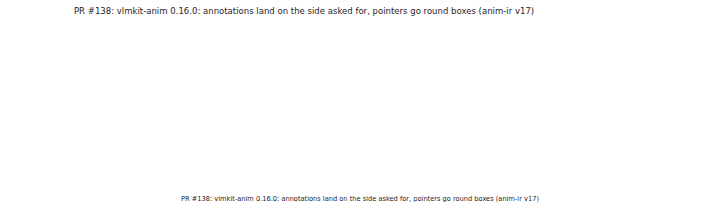
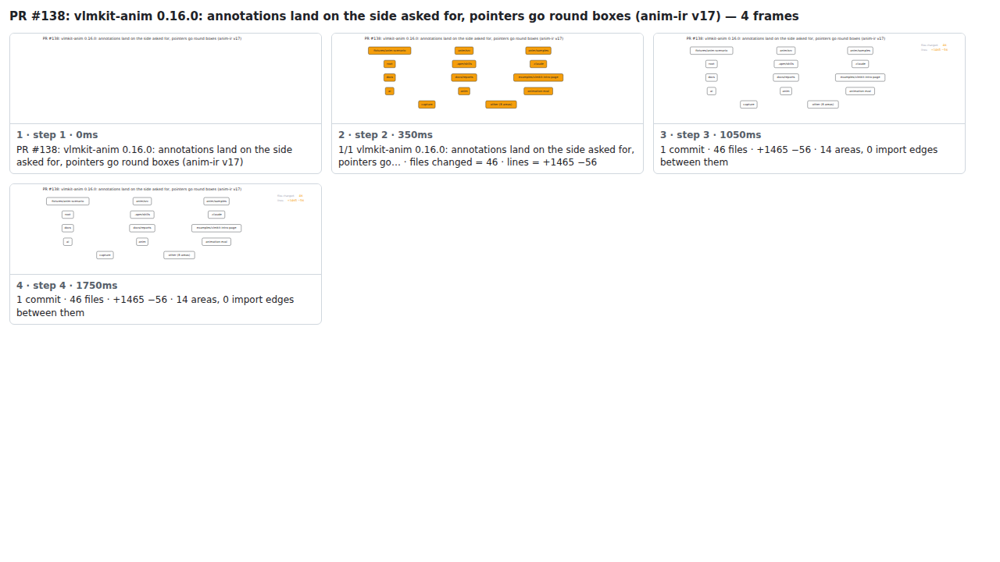

## PR #138: vlmkit-anim 0.16.0: annotations land on the side asked for, pointers go round boxes (anim-ir v17)



<details><summary>Every step</summary>



```
PR #138: vlmkit-anim 0.16.0: annotations land on the side asked for, pointers go round boxes (anim-ir v17) — 4 steps, 1960ms, 20 nodes
 1. [    0ms] PR #138: vlmkit-anim 0.16.0: annotations land on the side asked for, pointers go round boxes (anim-ir v17)
 2. [  350ms] 1/1 vlmkit-anim 0.16.0: annotations land on the side asked for, pointers go… · files changed = 46 · lines = +1465 −56
 3. [ 1050ms] 1 commit · 46 files · +1465 −56 · 14 areas, 0 import edges between them
 4. [ 1750ms] (end)
```

</details>

<sub>Generated by `vlmkit-anim pr`; the scene is [`change-map.scene.json`](./change-map.scene.json) — edit it and re-run `vlmkit-anim video` for a different cut, or `vlmkit-anim still` for the figure alone ([`change-map.svg`](./change-map.svg)).</sub>
