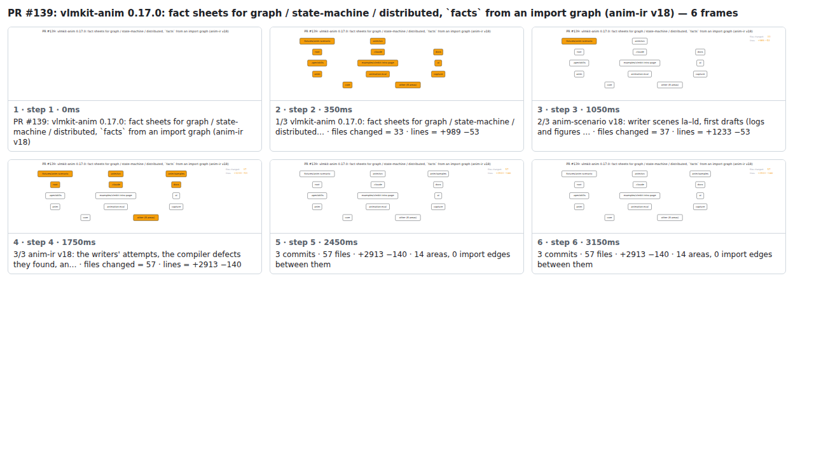

## PR #139: vlmkit-anim 0.17.0: fact sheets for graph / state-machine / distributed, `facts` from an import graph (anim-ir v18)


<details><summary>Every step</summary>



```
PR #139: vlmkit-anim 0.17.0: fact sheets for graph / state-machine / distributed, `facts` from an import graph (anim-ir v18) — 6 steps, 3360ms, 20 nodes
 1. [    0ms] PR #139: vlmkit-anim 0.17.0: fact sheets for graph / state-machine / distributed, `facts` from an import graph (anim-ir v18)
 2. [  350ms] 1/3 vlmkit-anim 0.17.0: fact sheets for graph / state-machine / distributed… · files changed = 33 · lines = +989 −53
 3. [ 1050ms] 2/3 anim-scenario v18: writer scenes la–ld, first drafts (logs and figures … · files changed = 37 · lines = +1233 −53
 4. [ 1750ms] 3/3 anim-ir v18: the writers' attempts, the compiler defects they found, an… · files changed = 57 · lines = +2913 −140
 5. [ 2450ms] 3 commits · 57 files · +2913 −140 · 14 areas, 0 import edges between them
 6. [ 3150ms] (end)
```

</details>

<sub>Generated by `vlmkit-anim pr`; the scene is [`change-map.scene.json`](./change-map.scene.json) — edit it and re-run `vlmkit-anim video` for a different cut, or `vlmkit-anim still` for the figure alone ([`change-map.svg`](./change-map.svg)).</sub>
