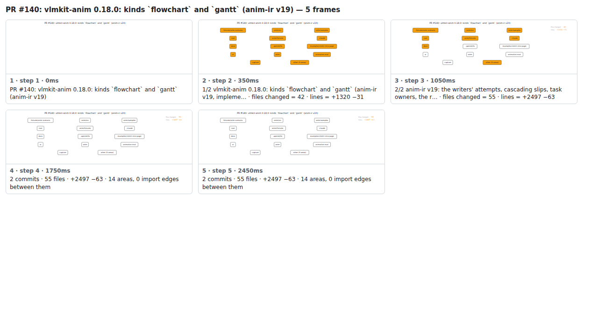

## PR #140: vlmkit-anim 0.18.0: kinds `flowchart` and `gantt` (anim-ir v19)


<details><summary>Every step</summary>



```
PR #140: vlmkit-anim 0.18.0: kinds `flowchart` and `gantt` (anim-ir v19) — 5 steps, 2660ms, 20 nodes
 1. [    0ms] PR #140: vlmkit-anim 0.18.0: kinds `flowchart` and `gantt` (anim-ir v19)
 2. [  350ms] 1/2 vlmkit-anim 0.18.0: kinds `flowchart` and `gantt` (anim-ir v19, impleme… · files changed = 42 · lines = +1320 −31
 3. [ 1050ms] 2/2 anim-ir v19: the writers' attempts, cascading slips, task owners, the r… · files changed = 55 · lines = +2497 −63
 4. [ 1750ms] 2 commits · 55 files · +2497 −63 · 14 areas, 0 import edges between them
 5. [ 2450ms] (end)
```

</details>

<sub>Generated by `vlmkit-anim pr`; the scene is [`change-map.scene.json`](./change-map.scene.json) — edit it and re-run `vlmkit-anim video` for a different cut, or `vlmkit-anim still` for the figure alone ([`change-map.svg`](./change-map.svg)).</sub>
