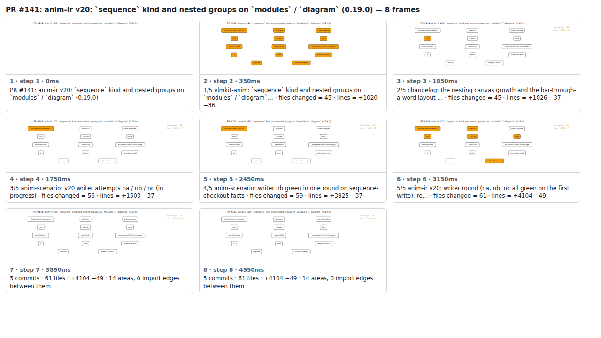

## PR #141: anim-ir v20: `sequence` kind and nested groups on `modules` / `diagram` (0.19.0)


<details><summary>Every step</summary>



```
PR #141: anim-ir v20: `sequence` kind and nested groups on `modules` / `diagram` (0.19.0) — 8 steps, 4760ms, 20 nodes
 1. [    0ms] PR #141: anim-ir v20: `sequence` kind and nested groups on `modules` / `diagram` (0.19.0)
 2. [  350ms] 1/5 vlmkit-anim: `sequence` kind and nested groups on `modules` / `diagram`… · files changed = 45 · lines = +1020 −36
 3. [ 1050ms] 2/5 changelog: the nesting canvas growth and the bar-through-a-word layout … · files changed = 45 · lines = +1026 −37
 4. [ 1750ms] 3/5 anim-scenario: v20 writer attempts na / nb / nc (in progress) · files changed = 56 · lines = +1503 −37
 5. [ 2450ms] 4/5 anim-scenario: writer nb green in one round on sequence-checkout-facts · files changed = 59 · lines = +3825 −37
 6. [ 3150ms] 5/5 anim-ir v20: writer round (na, nb, nc all green on the first write), re… · files changed = 61 · lines = +4104 −49
 7. [ 3850ms] 5 commits · 61 files · +4104 −49 · 14 areas, 0 import edges between them
 8. [ 4550ms] (end)
```

</details>

<sub>Generated by `vlmkit-anim pr`; the scene is [`change-map.scene.json`](./change-map.scene.json) — edit it and re-run `vlmkit-anim video` for a different cut, or `vlmkit-anim still` for the figure alone ([`change-map.svg`](./change-map.svg)).</sub>
