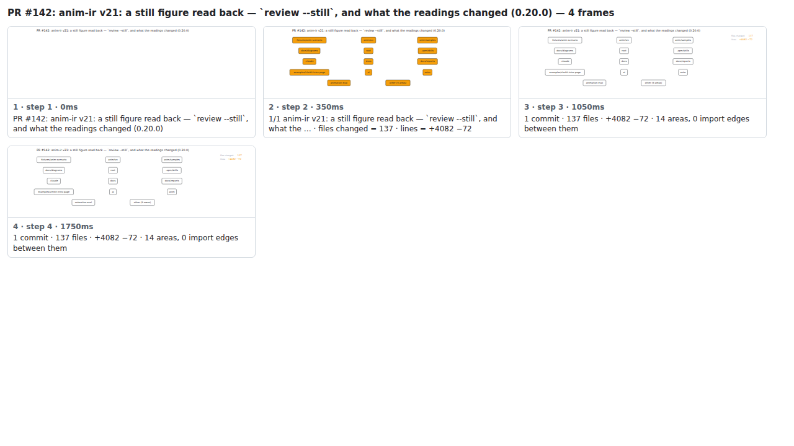

## PR #142: anim-ir v21: a still figure read back — `review --still`, and what the readings changed (0.20.0)


<details><summary>Every step</summary>



```
PR #142: anim-ir v21: a still figure read back — `review --still`, and what the readings changed (0.20.0) — 4 steps, 1960ms, 20 nodes
 1. [    0ms] PR #142: anim-ir v21: a still figure read back — `review --still`, and what the readings changed (0.20.0)
 2. [  350ms] 1/1 anim-ir v21: a still figure read back — `review --still`, and what the … · files changed = 137 · lines = +4082 −72
 3. [ 1050ms] 1 commit · 137 files · +4082 −72 · 14 areas, 0 import edges between them
 4. [ 1750ms] (end)
```

</details>

<sub>Generated by `vlmkit-anim pr`; the scene is [`change-map.scene.json`](./change-map.scene.json) — edit it and re-run `vlmkit-anim video` for a different cut, or `vlmkit-anim still` for the figure alone ([`change-map.svg`](./change-map.svg)).</sub>
