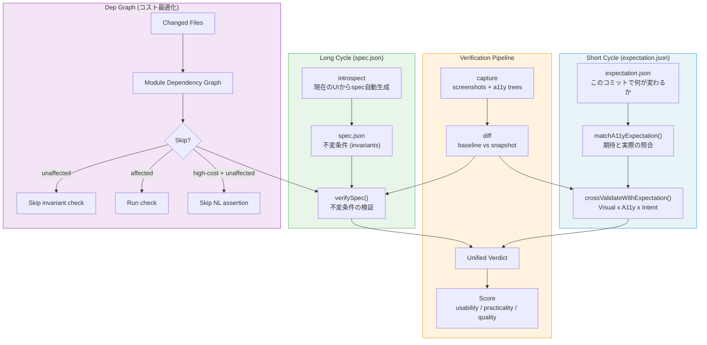
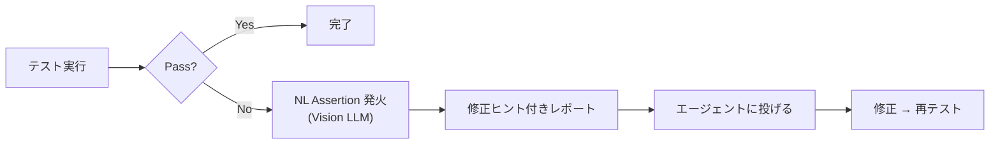

# VRT + Semantic Verification — Architecture

## 2層サイクル設計



## 2層の役割分担

| | Short Cycle (expectation) | Long Cycle (spec) |
|---|---|---|
| **寿命** | 1コミット | 複数コミットにまたがる |
| **内容** | 「何が変わるか」 | 「何が常に成り立つべきか」 |
| **例** | "nav を消す" | "全ページに main ランドマークがある" |
| **regression** | 期待された regression を approve | 不変条件の violation を reject |
| **生成** | 人間 or エージェントが書く | introspect で自動生成 |
| **上書き** | spec の不変条件を一時的に上書き | expectation で上書き可能 |

## Introspect フロー

```
現在の a11y ツリー
    ↓
introspect()
    ↓
PageIntrospection
  - landmarks: banner, main, nav, ...
  - interactive: 3 buttons, 5 links, 2 inputs
  - unlabeled: 0
  - suggestedInvariants: [...]
    ↓
introspectToSpec()
    ↓
spec.json (UiSpec)
  - pages:
    - home: nav exists, all labeled, no whiteout
    - about: main exists, heading h1
  - global: no whiteout, all labeled
```

## NL Assertion (将来)

```typescript
// Playwright テスト内での使い方 (将来)
test("home page", async ({ page }) => {
  await page.goto("/");

  // 通常のアサーション (安価)
  await expect(page.getByRole("heading")).toBeVisible();

  // NL assertion (高価 — テスト失敗時のみ発火)
  await nlAssert(page, "ナビゲーションバーに5つ以上のリンクがある", {
    dependsOn: ["src/Header.tsx"],
    onlyOnFailure: true,  // 他のアサーションが落ちた時のみ実行
  });
});
```

### onlyOnFailure パターン



### dep graph でのスキップ

```
変更ファイル: src/Footer.tsx
    ↓
dep graph 解析
    ↓
src/Header.tsx は影響を受けない
    ↓
Header に依存する NL assertion はスキップ
    ↓
Footer に依存するアサーションのみ実行
```

## コスト構造

| チェック種別 | コスト | 実行タイミング |
|---|---|---|
| ヒューリスティクス (whiteout, label) | 低 | 常に |
| ピクセル比較 (pixelmatch) | 中 | 常に |
| A11y ツリー diff | 低 | 常に |
| dep graph 解析 | 低 | 常に |
| Spec invariant 検証 | 低 | 影響ありの場合のみ |
| Visual Semantic 分類 | 低 | diff がある場合のみ |
| NL assertion (Vision LLM) | **高** | テスト失敗時 + 影響ありの場合のみ |
| LLM リーズニング | **高** | escalate された場合のみ |

## ファイル構成

```
vrt/
├── expectation.json         # Short cycle: このコミットの期待
├── spec.json                # Long cycle: 不変条件 (introspect で生成)
├── src/
│   ├── types.ts             # 全型定義 (UiSpec, NlAssertion 含む)
│   ├── introspect.ts        # introspect + verifySpec
│   ├── expectation.ts       # matchA11yExpectation + scoring
│   ├── cross-validation.ts  # Visual x A11y x Intent
│   ├── dep-graph.ts         # 依存ツリー (スキップ判定)
│   └── ...
├── fixtures/
│   └── react-sample/        # 再現可能テスト fixtures
│       ├── baseline.a11y.json
│       ├── snapshot-nav-removed.a11y.json
│       └── snapshot-label-broken.a11y.json
└── docs/
    ├── pipeline.md           # パイプライン図
    └── architecture.md       # この文書
```
