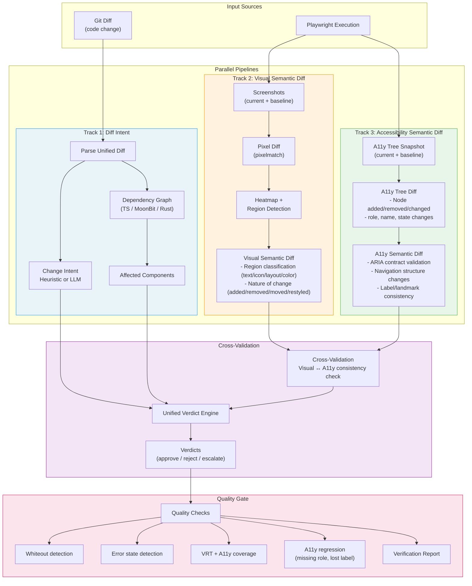

# VRT + Semantic Verification Pipeline

## Overall Design

Generate 3 independent diff sources in parallel and cross-validate them.

## Cross-Validation Matrix

Cross-reference Visual Diff and A11y Diff to determine change validity.

| Visual Diff | A11y Diff | Intent Match | Verdict |
|-------------|-----------|-------------|---------|
| None | None | any | **Auto-approve** (no change) |
| Yes | Yes | Yes | **Auto-approve** (as expected) |
| Yes | Yes | No | **Escalate** (unintended change) |
| Yes | None | style | **Approve** (visual-only change, semantics preserved) |
| Yes | None | refactor | **Warning** (refactor but visual changed) |
| None | Yes | any | **Reject** (same visually but semantics broken) |
| any | regression | any | **Reject** (A11y regression) |

## Data Flow Details

### Visual Semantic Diff

Classify the "meaning" of pixel differences:
- **text-change**: Changes in text regions (OCR-based detection)
- **color-change**: Color-only changes (shape unchanged)
- **layout-shift**: Element position movement
- **element-added**: New element appeared
- **element-removed**: Element disappeared
- **icon-change**: Icon/image changes

### Accessibility Semantic Diff

Structural diff of the A11y tree:
- **node-added**: New a11y node
- **node-removed**: Node disappeared (regression candidate)
- **role-changed**: role attribute changed
- **name-changed**: accessible name changed
- **state-changed**: aria-* state changed
- **structure-changed**: Tree structure changed (parent-child relationships)
- **landmark-changed**: Landmark changes (<nav>, <main>, etc.)

### Diff Intent

Intent inferred from code changes:
- **feature**: New feature → visual + a11y additions expected
- **bugfix**: Bug fix → only the fix target should change
- **refactor**: Refactor → no visual/a11y changes expected
- **style**: Style change → visual changes expected, no a11y changes
- **a11y**: Accessibility improvement → a11y changes expected, minimal visual changes
