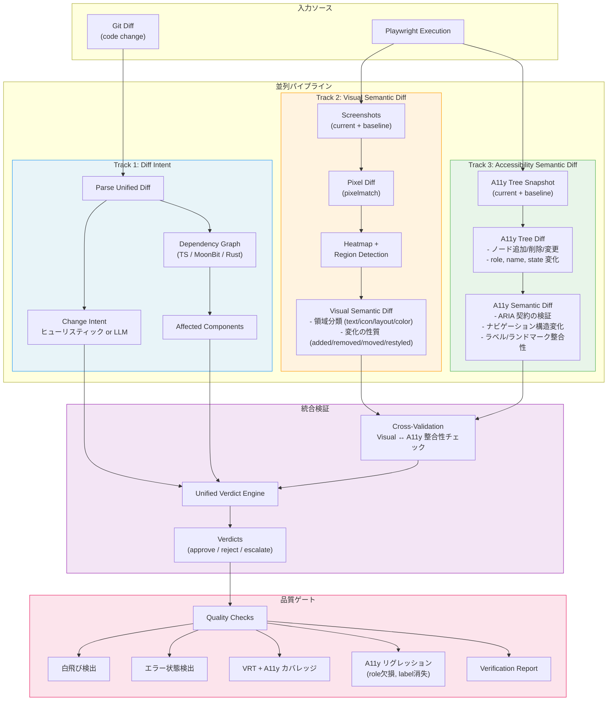

# VRT + Semantic Verification Pipeline

## 全体設計

3つの独立した Diff ソースを並列に生成し、統合検証で突き合わせる。

## Cross-Validation マトリクス

Visual Diff と A11y Diff の突き合わせで、変更の妥当性を判定する。

| Visual Diff | A11y Diff | Intent Match | 判定 |
|-------------|-----------|-------------|------|
| なし | なし | any | **Auto-approve** (変化なし) |
| あり | あり | あり | **Auto-approve** (期待通り) |
| あり | あり | なし | **Escalate** (意図しない変更) |
| あり | なし | style | **Approve** (見た目のみの変更、セマンティクス維持) |
| あり | なし | refactor | **Warning** (リファクタなのに見た目が変化) |
| なし | あり | any | **Reject** (見た目は同じだがセマンティクス破壊) |
| any | regression | any | **Reject** (A11y リグレッション) |

## データフロー詳細

### Visual Semantic Diff

ピクセル差分の「意味」を分類:
- **text-change**: テキスト領域の変化 (OCR ベースの検出)
- **color-change**: 色のみの変化 (形状は同一)
- **layout-shift**: 要素の位置移動
- **element-added**: 新しい要素の出現
- **element-removed**: 要素の消失
- **icon-change**: アイコン/画像の変化

### Accessibility Semantic Diff

A11y ツリーの構造差分:
- **node-added**: 新しい a11y ノード
- **node-removed**: ノードの消失 (リグレッション候補)
- **role-changed**: role 属性の変化
- **name-changed**: accessible name の変化
- **state-changed**: aria-* 状態の変化
- **structure-changed**: ツリー構造の変化 (親子関係)
- **landmark-changed**: ランドマーク (<nav>, <main> 等) の変化

### Diff Intent

コード変更から推測される意図:
- **feature**: 新機能 → visual + a11y の追加が期待される
- **bugfix**: バグ修正 → 修正対象のみの変化が期待される
- **refactor**: リファクタ → visual/a11y ともに変化なしが期待される
- **style**: スタイル変更 → visual 変化あり、a11y 変化なしが期待される
- **a11y**: アクセシビリティ改善 → a11y 変化あり、visual 変化は最小限
