# vlmkit-anim — sample outputs

One GIF (`vlmkit-anim video --width 420 --fps 12`) and one contact sheet (`vlmkit-anim sheet`,
every step as a labelled tile) per fixture in [`../fixtures/`](../fixtures/), with the
narration `vlmkit-anim explain` prints. Committed so a compiler change can be judged by
eye in a review; regenerate with `pnpm anim:samples` (all) or `pnpm anim:samples <name>…`.
Pixel output depends on the machine's font rasterisation, so these are not compared by a
test — `samples.test.ts` only checks that every fixture is represented here.

| fixture | kind | steps | length |
|---|---|---|---|
| [array-binary-search](#array-binary-search) | array | 9 | 4.8s |
| [chart-latency](#chart-latency) | chart | 6 | 3.4s |
| [compose-two-protocols](#compose-two-protocols) | compose | 7 | 2.2s |
| [diagram-cdn](#diagram-cdn) | diagram | 9 | 5.5s |
| [distributed-replication](#distributed-replication) | distributed | 8 | 3.8s |
| [graph-dijkstra](#graph-dijkstra) | graph | 15 | 8.4s |
| [heap-min](#heap-min) | heap | 16 | 8.1s |
| [list-linked](#list-linked) | list | 10 | 6.0s |
| [matrix-edit-distance](#matrix-edit-distance) | matrix | 12 | 6.6s |
| [matrix-vector-clock](#matrix-vector-clock) | matrix | 11 | 6.0s |
| [modules-checkout-ja](#modules-checkout-ja) | modules | 3 | 1.3s |
| [modules-ports-adapters](#modules-ports-adapters) | modules | 2 | 0.6s |
| [modules-web-service](#modules-web-service) | modules | 6 | 3.4s |
| [queue-print-jobs](#queue-print-jobs) | queue | 6 | 3.5s |
| [sort-bubble](#sort-bubble) | sort | 31 | 12.3s |
| [sort-insertion](#sort-insertion) | sort | 21 | 8.3s |
| [stack-brackets](#stack-brackets) | stack | 7 | 4.1s |
| [state-tcp](#state-tcp) | state-machine | 7 | 5.8s |
| [tree-bst](#tree-bst) | tree | 18 | 11.3s |
| [vector-bounce](#vector-bounce) | vector | 2 | 2.3s |

## array-binary-search

`array` — [`fixtures/array-binary-search.json`](../fixtures/array-binary-search.json) · 9 steps · 4.8s · GIF 363 KB


<details><summary>Contact sheet (every step) and narration</summary>


```
Binary search for 23 — 9 steps, 4800ms, 41 nodes
 1. [    0ms] Binary search for 23
 2. [  360ms] Search for 23: lo = 0, hi = 9
 3. [  960ms] mid = (0 + 9) / 2 = 4
 4. [ 1560ms] a[4] = 16 < 23: the answer is to the right, lo = 5
 5. [ 2160ms] mid = (5 + 9) / 2 = 7
 6. [ 2760ms] a[7] = 56 > 23: the answer is to the left, hi = 6
 7. [ 3360ms] mid = (5 + 6) / 2 = 5
 8. [ 3960ms] a[5] = 23: found 23 at index 5
 9. [ 4560ms] (end)
```

</details>

## chart-latency

`chart` — [`fixtures/chart-latency.json`](../fixtures/chart-latency.json) · 6 steps · 3.4s · GIF 280 KB


<details><summary>Contact sheet (every step) and narration</summary>


```
p95 latency by region (ms) — 6 steps, 3430ms, 33 nodes
 1. [    0ms] p95 latency by region (ms)
 2. [  350ms] Before: every request hits the database
 3. [ 1050ms] The SLO is 100 ms; two regions miss it
 4. [ 1750ms] After: a regional cache absorbs most reads
 5. [ 2450ms] ap improves most — it was furthest from the database
 6. [ 3150ms] (end)
```

</details>

## compose-two-protocols

`compose` — [`fixtures/compose-two-protocols.json`](../fixtures/compose-two-protocols.json) · 7 steps · 2.2s · GIF 118 KB

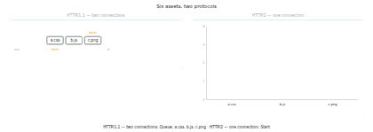

<details><summary>Contact sheet (every step) and narration</summary>

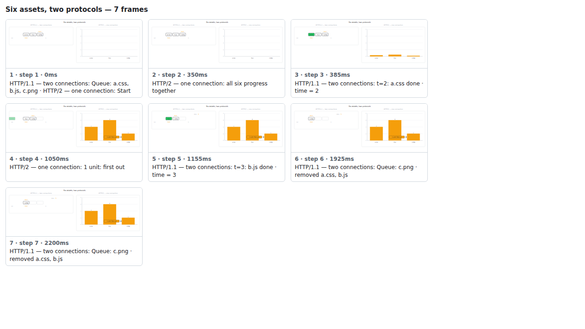

```
Six assets, two protocols — 7 steps, 2200ms, 40 nodes
 1. [    0ms] HTTP/1.1 — two connections: Queue: a.css, b.js, c.png · HTTP/2 — one connection: Start
 2. [  350ms] HTTP/2 — one connection: all six progress together
 3. [  385ms] HTTP/1.1 — two connections: t=2: a.css done · time = 2
 4. [ 1050ms] HTTP/2 — one connection: 1 unit: first out
 5. [ 1155ms] HTTP/1.1 — two connections: t=3: b.js done · time = 3
 6. [ 1925ms] HTTP/1.1 — two connections: Queue: c.png · removed a.css, b.js
 7. [ 2200ms] (end)
```

</details>

## diagram-cdn

`diagram` — [`fixtures/diagram-cdn.json`](../fixtures/diagram-cdn.json) · 9 steps · 5.5s · GIF 345 KB


<details><summary>Contact sheet (every step) and narration</summary>

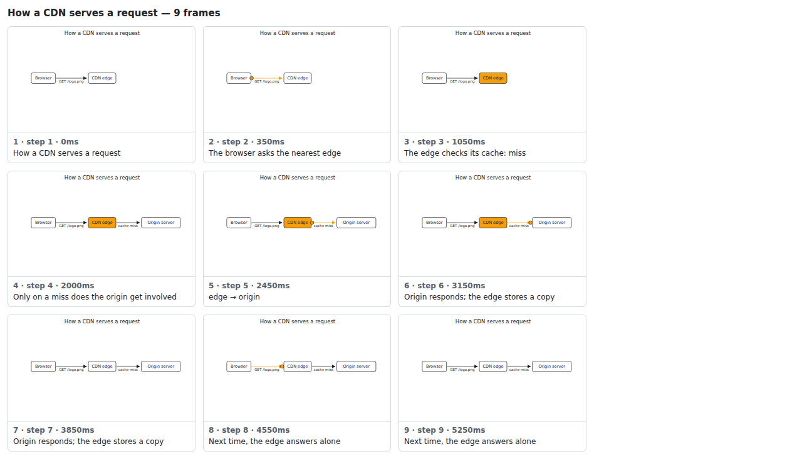

```
How a CDN serves a request — 9 steps, 5460ms, 9 nodes
 1. [    0ms] How a CDN serves a request
 2. [  350ms] The browser asks the nearest edge
 3. [ 1050ms] The edge checks its cache: miss
 4. [ 2000ms] Only on a miss does the origin get involved
 5. [ 2450ms] edge → origin
 6. [ 3150ms] Origin responds; the edge stores a copy
 7. [ 3850ms]
 8. [ 4550ms] Next time, the edge answers alone
 9. [ 5250ms] (end)
```

</details>

## distributed-replication

`distributed` — [`fixtures/distributed-replication.json`](../fixtures/distributed-replication.json) · 8 steps · 3.8s · GIF 336 KB


<details><summary>Contact sheet (every step) and narration</summary>


```
Primary-replica write with a failover — 8 steps, 3780ms, 25 nodes
 1. [    0ms] client → primary: write x=1
 2. [  600ms] primary → replica: replicate x=1
 3. [ 1200ms] replica → primary: ack
 4. [ 1800ms] primary → client: ok
 5. [ 2400ms] primary has crashed: the write is lost
 6. [ 2500ms] primary crashes
 7. [ 3000ms] client retries against the promoted replica · replica is promoted
 8. [ 3600ms] end
```

</details>

## graph-dijkstra

`graph` — [`fixtures/graph-dijkstra.json`](../fixtures/graph-dijkstra.json) · 15 steps · 8.4s · GIF 585 KB

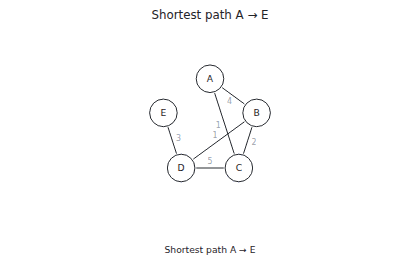

<details><summary>Contact sheet (every step) and narration</summary>

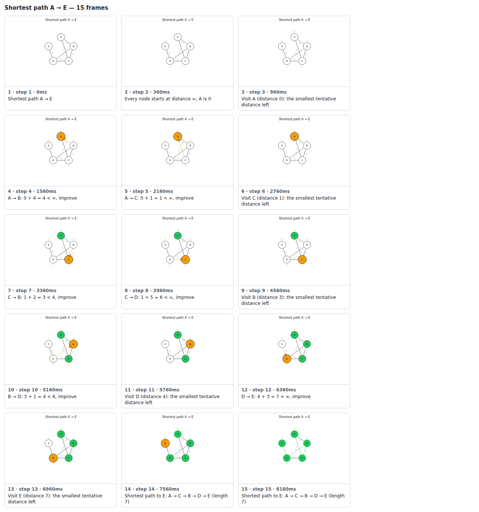

```
Shortest path A → E — 15 steps, 8400ms, 24 nodes
 1. [    0ms] Shortest path A → E
 2. [  360ms] Every node starts at distance ∞; A is 0
 3. [  960ms] Visit A (distance 0): the smallest tentative distance left
 4. [ 1560ms] A → B: 0 + 4 = 4 < ∞, improve
 5. [ 2160ms] A → C: 0 + 1 = 1 < ∞, improve
 6. [ 2760ms] Visit C (distance 1): the smallest tentative distance left
 7. [ 3360ms] C → B: 1 + 2 = 3 < 4, improve
 8. [ 3960ms] C → D: 1 + 5 = 6 < ∞, improve
 9. [ 4560ms] Visit B (distance 3): the smallest tentative distance left
10. [ 5160ms] B → D: 3 + 1 = 4 < 6, improve
11. [ 5760ms] Visit D (distance 4): the smallest tentative distance left
12. [ 6360ms] D → E: 4 + 3 = 7 < ∞, improve
13. [ 6960ms] Visit E (distance 7): the smallest tentative distance left
14. [ 7560ms] Shortest path to E: A → C → B → D → E (length 7)
15. [ 8160ms] (end)
```

</details>

## heap-min

`heap` — [`fixtures/heap-min.json`](../fixtures/heap-min.json) · 16 steps · 8.1s · GIF 511 KB


<details><summary>Contact sheet (every step) and narration</summary>


```
Min-heap push and pop — 16 steps, 8140ms, 13 nodes
 1. [    0ms] Empty min-heap
 2. [  385ms] push 5: place it in the next free slot
 3. [  935ms] push 3: place it in the next free slot
 4. [ 1485ms] 3 < parent 5: swap up
 5. [ 2035ms] push 8: place it in the next free slot
 6. [ 2585ms] 8 vs parent 3: heap property holds
 7. [ 2915ms] push 1: place it in the next free slot
 8. [ 3465ms] 1 < parent 5: swap up
 9. [ 4015ms] 1 < parent 3: swap up
10. [ 4565ms] pop: the root 1 comes out
11. [ 5115ms] Move the last value 5 to the root
12. [ 5665ms] 3 < 5: swap down with the smaller child
13. [ 6215ms] pop: the root 3 comes out
14. [ 6765ms] Move the last value 8 to the root
15. [ 7315ms] 5 < 8: swap down with the smaller child
16. [ 7865ms] Done. Heap: 5, 8; popped 1, 3
```

</details>

## list-linked

`list` — [`fixtures/list-linked.json`](../fixtures/list-linked.json) · 10 steps · 6.0s · GIF 344 KB


<details><summary>Contact sheet (every step) and narration</summary>


```
Singly linked list — 10 steps, 6050ms, 18 nodes
 1. [    0ms] Singly linked list
 2. [  385ms] Insert 5 after 3: 3 will point to 5, and 5 to 7
 3. [ 1210ms] Insert 1 at the head: no shifting, the head pointer just moves
 4. [ 2035ms] Remove 7: 5 now points to 9
 5. [ 2860ms] 1 ≠ 9: follow next
 6. [ 3245ms] 3 ≠ 9: follow next
 7. [ 3630ms] 5 ≠ 9: follow next
 8. [ 4015ms] 9 = 9: found it after 3 hops
 9. [ 4675ms] Reverse: every next pointer turns around; the old tail 9 is the new head
10. [ 5775ms] List: 9 → 5 → 3 → 1 → ∅
```

</details>

## matrix-edit-distance

`matrix` — [`fixtures/matrix-edit-distance.json`](../fixtures/matrix-edit-distance.json) · 12 steps · 6.6s · GIF 881 KB


<details><summary>Contact sheet (every step) and narration</summary>


```
Edit distance: cat → cut — 12 steps, 6600ms, 32 nodes
 1. [    0ms] Edit distance: cat → cut
 2. [  360ms] c = c: copy the diagonal
 3. [  960ms] c ≠ u: 1 + the smallest neighbour
 4. [ 1560ms] (c, t) = 2 (from (c, u))
 5. [ 2160ms] (a, c) = 1 (from (c, c))
 6. [ 2760ms] a ≠ u: 1 + min(diagonal, above, left) = 1 + 0
 7. [ 3360ms] (a, t) = 2 (from (a, u))
 8. [ 3960ms] (t, c) = 2 (from (a, c))
 9. [ 4560ms] (t, u) = 2 (from (a, u))
10. [ 5160ms] t = t: copy the diagonal
11. [ 5760ms] Edit distance is 1
12. [ 6360ms] (end)
```

</details>

## matrix-vector-clock

`matrix` — [`fixtures/matrix-vector-clock.json`](../fixtures/matrix-vector-clock.json) · 11 steps · 6.0s · GIF 422 KB

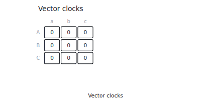

<details><summary>Contact sheet (every step) and narration</summary>

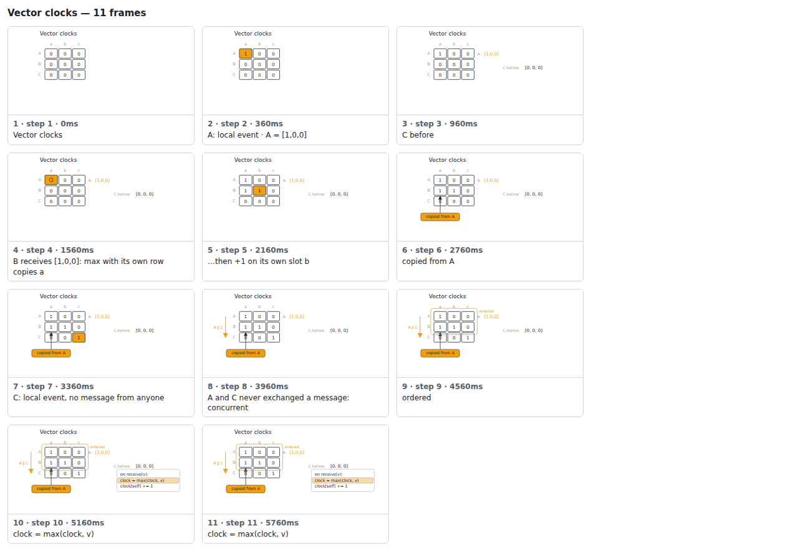

```
Vector clocks — 11 steps, 6000ms, 38 nodes
 1. [    0ms] Vector clocks
 2. [  360ms] A: local event · A = [1,0,0]
 3. [  960ms] C before
 4. [ 1560ms] B receives [1,0,0]: max with its own row copies a
 5. [ 2160ms] …then +1 on its own slot b
 6. [ 2760ms] copied from A
 7. [ 3360ms] C: local event, no message from anyone
 8. [ 3960ms] A and C never exchanged a message: concurrent
 9. [ 4560ms] ordered
10. [ 5160ms]   clock = max(clock, v)
11. [ 5760ms] (end)
```

</details>

## modules-checkout-ja

`modules` — [`fixtures/modules-checkout-ja.json`](../fixtures/modules-checkout-ja.json) · 3 steps · 1.3s · GIF 169 KB

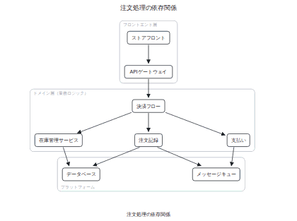

<details><summary>Contact sheet (every step) and narration</summary>

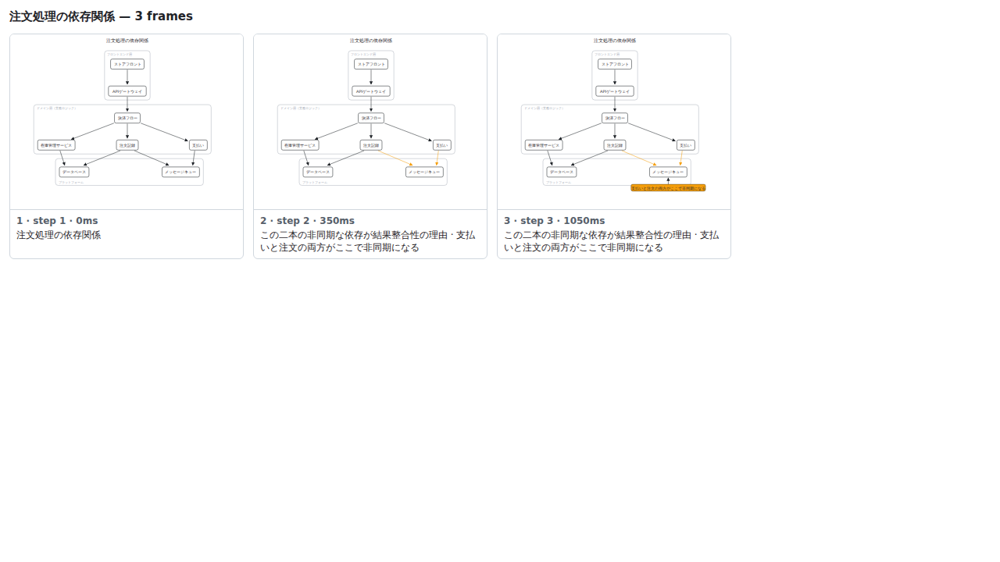

```
注文処理の依存関係 — 3 steps, 1260ms, 28 nodes
 1. [    0ms] 注文処理の依存関係
 2. [  350ms] この二本の非同期な依存が結果整合性の理由 · 支払いと注文の両方がここで非同期になる
 3. [ 1050ms] (end)
```

</details>

## modules-ports-adapters

`modules` — [`fixtures/modules-ports-adapters.json`](../fixtures/modules-ports-adapters.json) · 2 steps · 0.6s · GIF 64 KB

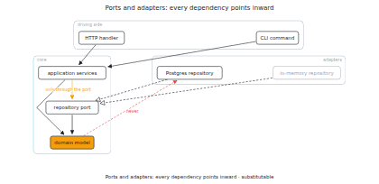

<details><summary>Contact sheet (every step) and narration</summary>

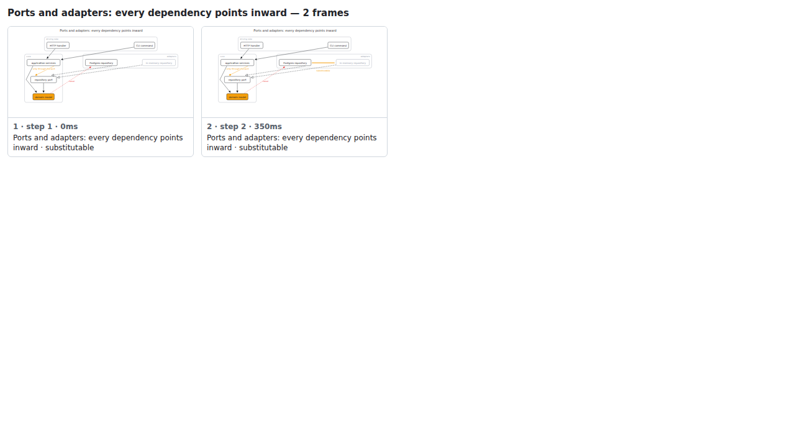

```
Ports and adapters: every dependency points inward — 2 steps, 560ms, 28 nodes
 1. [    0ms] Ports and adapters: every dependency points inward · substitutable
 2. [  350ms] (end)
```

</details>

## modules-web-service

`modules` — [`fixtures/modules-web-service.json`](../fixtures/modules-web-service.json) · 6 steps · 3.4s · GIF 343 KB

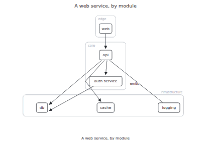

<details><summary>Contact sheet (every step) and narration</summary>

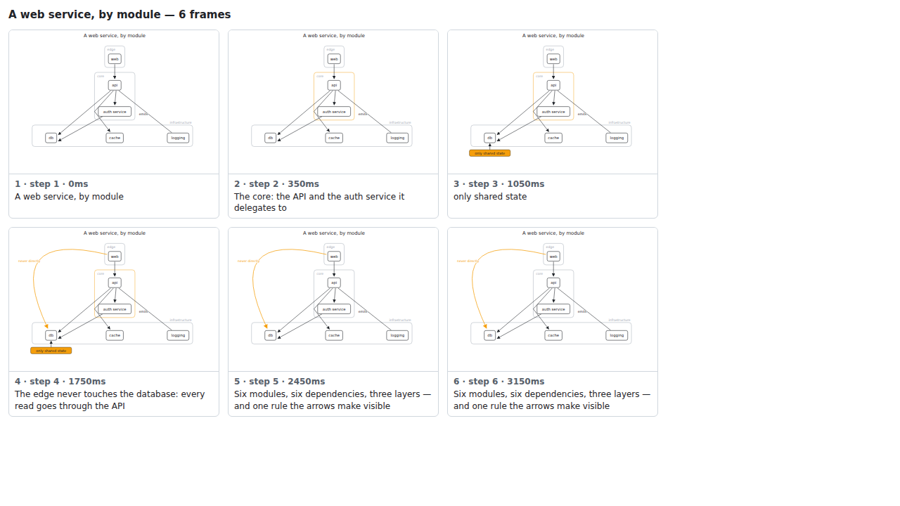

```
A web service, by module — 6 steps, 3360ms, 26 nodes
 1. [    0ms] A web service, by module
 2. [  350ms] The core: the API and the auth service it delegates to
 3. [ 1050ms] only shared state
 4. [ 1750ms] The edge never touches the database: every read goes through the API
 5. [ 2450ms] Six modules, six dependencies, three layers — and one rule the arrows make visible
 6. [ 3150ms] (end)
```

</details>

## queue-print-jobs

`queue` — [`fixtures/queue-print-jobs.json`](../fixtures/queue-print-jobs.json) · 6 steps · 3.5s · GIF 202 KB


<details><summary>Contact sheet (every step) and narration</summary>


```
Print jobs — 6 steps, 3465ms, 11 nodes
 1. [    0ms] Print jobs
 2. [  385ms] enqueue memo.txt: it joins at the back
 3. [ 1045ms] The printer takes the oldest job first
 4. [ 1815ms] peek → photo.png: the front, left in place
 5. [ 2420ms] dequeue → photo.png: the first one in is the first one out
 6. [ 3190ms] Queue: memo.txt · removed report.pdf, photo.png
```

</details>

## sort-bubble

`sort` — [`fixtures/sort-bubble.json`](../fixtures/sort-bubble.json) · 31 steps · 12.3s · GIF 822 KB


<details><summary>Contact sheet (every step) and narration</summary>


```
Bubble sort — 31 steps, 12350ms, 19 nodes
 1. [    0ms] Start: 5, 3, 8, 1, 9, 2
 2. [  300ms] Compare 5 and 3: out of order
 3. [  700ms] Swap 5 and 3
 4. [ 1200ms] Compare 5 and 8: in order
 5. [ 1600ms] Compare 8 and 1: out of order
 6. [ 2000ms] Swap 8 and 1
 7. [ 2500ms] Compare 8 and 9: in order
 8. [ 2900ms] Compare 9 and 2: out of order
 9. [ 3300ms] Swap 9 and 2
10. [ 3800ms] 9 is in its final place
11. [ 4100ms] Compare 3 and 5: in order
12. [ 4500ms] Compare 5 and 1: out of order
13. [ 4900ms] Swap 5 and 1
14. [ 5400ms] Compare 5 and 8: in order
15. [ 5800ms] Compare 8 and 2: out of order
16. [ 6200ms] Swap 8 and 2
17. [ 6700ms] 8 is in its final place
18. [ 7000ms] Compare 3 and 1: out of order
19. [ 7400ms] Swap 3 and 1
20. [ 7900ms] Compare 3 and 5: in order
21. [ 8300ms] Compare 5 and 2: out of order
22. [ 8700ms] Swap 5 and 2
23. [ 9200ms] 5 is in its final place
24. [ 9500ms] Compare 1 and 3: in order
25. [ 9900ms] Compare 3 and 2: out of order
26. [10300ms] Swap 3 and 2
27. [10800ms] 3 is in its final place
28. [11100ms] Compare 1 and 2: in order
29. [11500ms] 2 is in its final place
30. [11800ms] No swaps in this pass: the rest is already sorted
31. [12100ms] Sorted: 1, 2, 3, 5, 8, 9
```

</details>

## sort-insertion

`sort` — [`fixtures/sort-insertion.scene.ts`](../fixtures/sort-insertion.scene.ts) · 21 steps · 8.3s · GIF 509 KB


<details><summary>Contact sheet (every step) and narration</summary>


```
Insertion sort — 21 steps, 8250ms, 16 nodes
 1. [    0ms] Start: 5, 3, 8, 1, 4
 2. [  300ms] First element 5 is a sorted run of one
 3. [  600ms] Insert 3 into the sorted run
 4. [ 1000ms] Swap 5 and 3
 5. [ 1500ms] Positions 0, 1 are sorted
 6. [ 1800ms] Insert 8 into the sorted run
 7. [ 2200ms] Positions 0, 1, 2 are sorted
 8. [ 2500ms] Insert 1 into the sorted run
 9. [ 2900ms] Swap 8 and 1
10. [ 3400ms] Compare 5 and 1: out of order
11. [ 3800ms] Swap 5 and 1
12. [ 4300ms] Compare 3 and 1: out of order
13. [ 4700ms] Swap 3 and 1
14. [ 5200ms] Positions 0, 1, 2, 3 are sorted
15. [ 5500ms] Insert 4 into the sorted run
16. [ 5900ms] Swap 8 and 4
17. [ 6400ms] Compare 5 and 4: out of order
18. [ 6800ms] Swap 5 and 4
19. [ 7300ms] Compare 3 and 4: in order
20. [ 7700ms] Positions 0, 1, 2, 3, 4 are sorted
21. [ 8000ms] Sorted: 1, 3, 4, 5, 8
```

</details>

## stack-brackets

`stack` — [`fixtures/stack-brackets.json`](../fixtures/stack-brackets.json) · 7 steps · 4.1s · GIF 342 KB

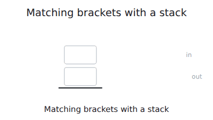

<details><summary>Contact sheet (every step) and narration</summary>

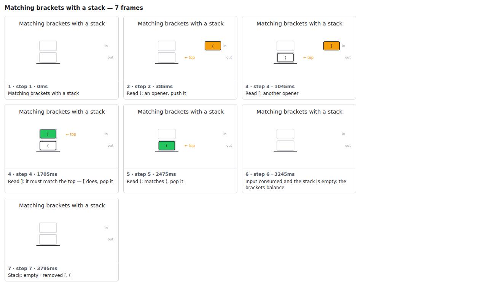

```
Matching brackets with a stack — 7 steps, 4070ms, 9 nodes
 1. [    0ms] Matching brackets with a stack
 2. [  385ms] Read (: an opener, push it
 3. [ 1045ms] Read [: another opener
 4. [ 1705ms] Read ]: it must match the top — [ does, pop it
 5. [ 2475ms] Read ): matches (, pop it
 6. [ 3245ms] Input consumed and the stack is empty: the brackets balance
 7. [ 3795ms] Stack: empty · removed [, (
```

</details>

## state-tcp

`state-machine` — [`fixtures/state-tcp.json`](../fixtures/state-tcp.json) · 7 steps · 5.8s · GIF 365 KB

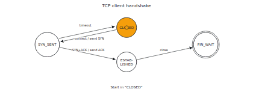

<details><summary>Contact sheet (every step) and narration</summary>

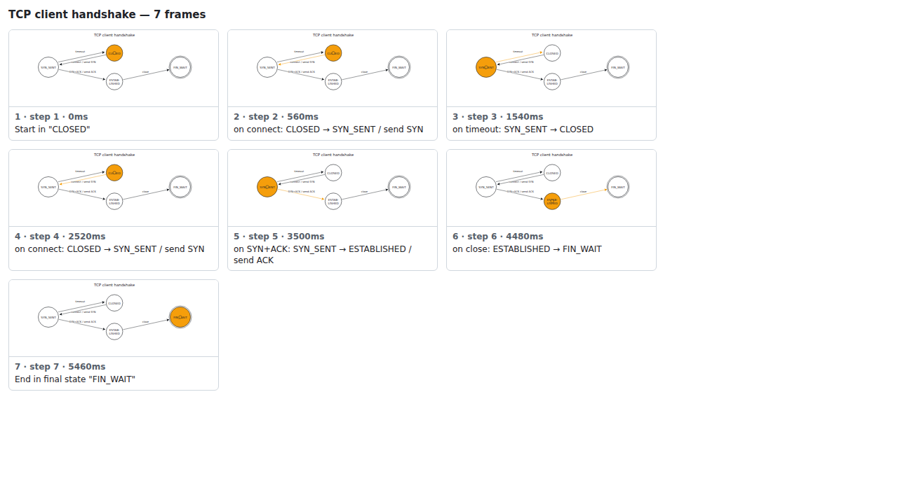

```
TCP client handshake — 7 steps, 5810ms, 15 nodes
 1. [    0ms] Start in "CLOSED"
 2. [  560ms] on connect: CLOSED → SYN_SENT / send SYN
 3. [ 1540ms] on timeout: SYN_SENT → CLOSED
 4. [ 2520ms] on connect: CLOSED → SYN_SENT / send SYN
 5. [ 3500ms] on SYN+ACK: SYN_SENT → ESTABLISHED / send ACK
 6. [ 4480ms] on close: ESTABLISHED → FIN_WAIT
 7. [ 5460ms] End in final state "FIN_WAIT"
```

</details>

## tree-bst

`tree` — [`fixtures/tree-bst.json`](../fixtures/tree-bst.json) · 18 steps · 11.3s · GIF 850 KB


<details><summary>Contact sheet (every step) and narration</summary>


```
Binary search tree — 18 steps, 11330ms, 25 nodes
 1. [    0ms] BST with 1, 3, 6, 8, 10
 2. [  385ms] Insert 14: start at the root 8. 14 > 8: go right
 3. [  825ms] 14 > 10: go right
 4. [ 1265ms] Attach 14 as the right child of 10
 5. [ 1925ms] Insert 4: start at the root 8. 4 < 8: go left
 6. [ 2365ms] 4 > 3: go right
 7. [ 2805ms] 4 < 6: go left
 8. [ 3245ms] 4 goes under 3, then right of 3: 3 < 4 < 6
 9. [ 3905ms] Search 6: start at the root 8. 6 < 8: go left
10. [ 4345ms] 6 > 3: go right
11. [ 4785ms] 6 = 6: this is the node
12. [ 5225ms] Found 6 after 3 comparisons
13. [ 5885ms] Delete 3: start at the root 8. 3 < 8: go left
14. [ 6325ms] 3 = 3: this is the node
15. [ 6765ms] 3 has two children: its in-order successor 4 takes its place
16. [ 7755ms] Inorder traversal: left subtree, node, right subtree — the values come out sorted
17. [10505ms] inorder: 1, 4, 6, 8, 10, 14
18. [11055ms] Tree holds 1, 4, 6, 8, 10, 14
```

</details>

## vector-bounce

`vector` — [`fixtures/vector-bounce.json`](../fixtures/vector-bounce.json) · 2 steps · 2.3s · GIF 90 KB


<details><summary>Contact sheet (every step) and narration</summary>


```
Ease comparison — 2 steps, 2300ms, 3 nodes
 1. [    0ms] linear: constant speed
 2. [ 1500ms] back, fading
```

</details>
